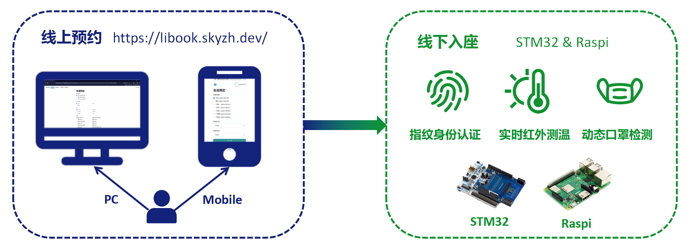
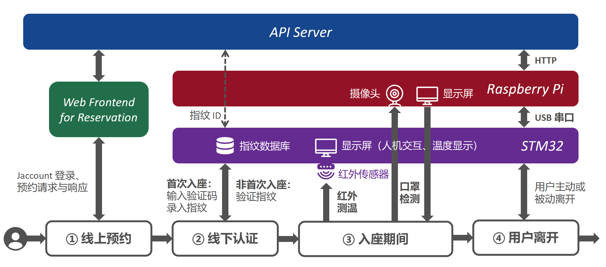
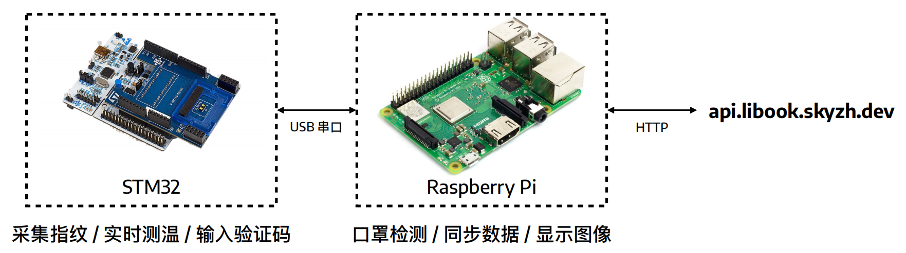
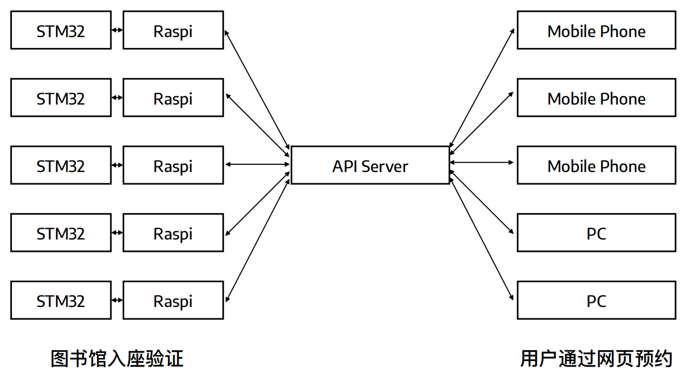

# library-book-embedded

## Introduction

Embedded end of ***Libook***, an open-source library seat booking system in the post-epidemic era.

* **Embedded-end**
  
  * [STM32](https://github.com/sjtu-libook/libook-embedded/tree/master/STM32)
  * [Raspi](https://github.com/sjtu-libook/libook-embedded/tree/master/Raspi)
  
* **Server-end** : https://github.com/sjtu-libook/libook

## License

[Apache-2.0 License](https://github.com/sjtu-libook/libook-embedded/blob/master/LICENSE)

## Our Work

<h4>Features Overview : A User's Perspective</h4>

---

<h4>Human-Machine Interaction Workflow</h4>

---

<h4>Embedded-end Architecture</h4>

---

<h4>Multi-device Organization</h4>

